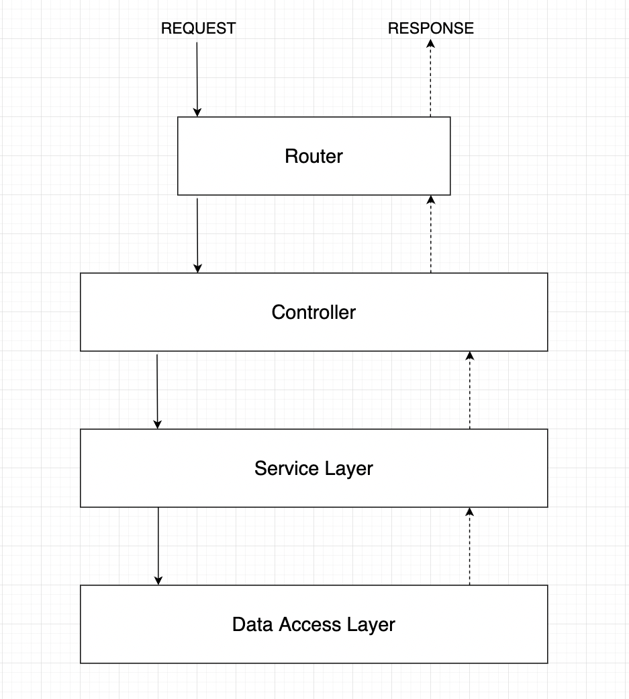

## api-design
This project focuses on designing RESTful APIs using Express.js and Node.js, following a three-layer architecture that includes Router, Controller, and Service components, while also implementing versioning for better API management.

### APIs Architecture

### Tech-Stacks
* [Node.js](https://nodejs.org/en/)
* [Express.js](https://expressjs.com/)
* JavaScript
* REST API

### Key Features
* Versioning
* session-based authentication
* Error Handling
* Data caching
* Pagination, sorting, and filtering
